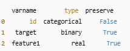
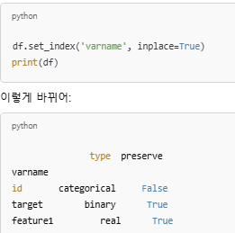
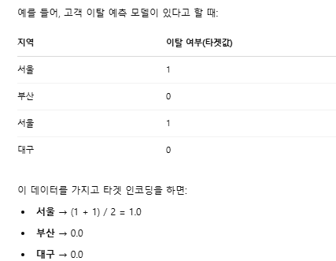
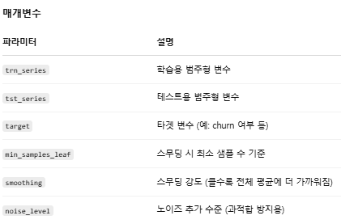

## 변수들에 대한 메타데이터 정리

for문 사용해 변수의 역할/데이터 유형/보존 여부/dtype/카테고리를 분류한 metadata 생성

<br/>

```py
data = [] #여기에 각 변수의 메타정보를 담을 딕셔너리 하나씩 추가

#  변수 역할 구분
if feature == 'target':
    use = 'target'
elif feature == 'id':
    use = 'id'
else:
    use = 'input'


# 변수 데이터 유형
if 'bin' in feature or feature == 'target':
    type = 'binary'  # 0/1 같은 이진값
elif 'cat' in feature or feature == 'id':
    type = 'categorical'  # 범주형 변수
elif trainset[feature].dtype == float or isinstance(trainset[feature].dtype, float):
    type = 'real'  # 실수형
elif trainset[feature].dtype == int:
    type = 'integer'  # 정수형

# 보존 여부 (preserve)
preserve = True
if feature == 'id':
    preserve = False # 분석에 필요한 변수만 보존할건데 id는 일반적으로 분석에 사용되지 않으므로 false

# dtype
dtype = trainset[feature].dtype #판다스의 원래 데이터 타입 사용

# category
if 'ind' in feature:
    category = 'individual' #사람
elif 'reg' in feature:
    category = 'registration' #등록 정보
elif 'car' in feature:
    category = 'car' #자동차 관련
elif 'calc' in feature:
    category = 'calculated' #계산된 값

# metadata 생성
feature_dictionary = {
    'varname': feature,
    'use': use,
    'type': type,
    'preserve': preserve,
    'dtype': dtype,
    'category' : category
}
data.append(feature_dictionary) # 모든 변수를 하나씩 딕셔너리로 만들어 리스트에 추가

metadata = pd.DataFrame(data, columns=['varname', 'use', 'type', 'preserve', 'dtype', 'category']) #판다스 DataFrame으로 만들고
metadata.set_index('varname', inplace=True) #varname을 인덱스로 설정
```
- varname을 인덱스로 설정한다는 것은<br/>
<br/>
이렇게 판다스에서는 자동으로 행의 번호를 0, 1, 2...로 붙이는데 <br/>
<br/>
인덱스를 varname으로 설정하면 varname 열(id, target, feature1 등..)이 0, 1, 2 대신 행의 번호로 쓰이는 것!<br/>
다시 말해, 행의 이름(label)이 'id', 'target', 'feature1' 등이 된다.

<br/>
<br/>

```py
metadata[(metadata.type == 'categorical') & (metadata.preserve)].index
# type == 'categorical' : 범주형 변수만 선택
# preserve == : True 분석에 사용할 변수만 선택
# .index : 해당 조건을 만족하는 변수 이름만 추출
```

- 이렇게 하면 나중에 원하는 변수만 쉽게 선택/필터링할 수 있음 <br/>
💡 이렇게 metadata 프레임을 만들어두면 셀프 자동화 도구를 만드는 셈! 다른 데이터셋에서도 유용하다 <br/>
특히 *변수가 30개 이상일 때*, *여러 데이터셋에 공통적으로 전처리 파이프라인을 짜야할 때*, *EDA, 모델 실험을 반복적으로 할 때* 유용함
<br/>
<br/>
<br/>

## 특정 변수만 곱하거나 제곱해서 변환하기
 실수(float).describe 결과 보고 
 
 ```py
 (pow(trainset['ps_car_12']*10,2)).head(10)

 (pow(trainset['ps_car_15'],2)).head(10)
 ```

 - 'ps_car_12'는 10을 곱한 후 제곱, 'ps_car_15'는 제곱함. 이유는?🤔
    - ps_car_12: 자연수 제곱근을 10으로 나눈 값
        - 실제 자연수형 데이터를 √ 연산 + 10으로 나눈 것.
        - 예: 차량 마력 수, 무게, 연식 등 실수형인데 너무 큰 값을 줄이기 위해 변형했을 가능성
    > ps_car_12는 √값이니까 → 제곱하면 원래 자연수 값 복원<br/> √4 / 10 = 0.2 → 제곱하면 0.04.<br/>
    그러니까 제곱하고 10을 곱하면 원래값을 간접적으로 복원 가능

    <br/>

  - ps_car_15: 
    - 이건 정수를 단순히 √ 연산만 한 값이라 카테고리적인 숫자 특성이 있거나,
    - 아니면 어떤 순서형 특성에 루트만 씌운 케이스일 수도 있음
    > √ 자연수니까 → 제곱하면 정수로 복원됨!
<br/>
<br/>

 💡 ps_car_12, ps_car_15는 원래 자연수 값에서 √ 연산을 거쳐 변형된 것이고, 분석자는 **이걸 제곱함으로써 원래 의미 있는 정수로 복원하려 한 것**


➡️ 이외에 *10으로 스케일 키우고, 제곱으로 비선형 변환(ex. 작은 차이가 더 큰 영향을 미치게)까지 해서 변수 영향력 강조하기도 함!

<br/>
<br/>
<br/>


# 범주형 변수 target encoding

## 개념 설명
### target encdoing이란?
- 범주형 변수를 숫자로 바꾸는 기법 중 하나
    - 각 범주에 대해 그 범주의 평균 타겟값으로 숫자를 부여 <br/>
     <br/>
    - 이렇게 지역이라는 범주형 변수를 숫자로 바꿔서 모델에 넣음

<br/>

### smoothing 기법
```py
def target_encode(trn_series=None,
                  tst_series=None,
                  target=None,
                  min_samples_leaf=1,
                  smoothing=1, 
                  noise_level=0):
```

- 단순 평균 대신, 빈도수와 전체 평균을 함께 고려하는 기법
- 과적합을 방지할 수 있음
<br/>

## 흐름 정리
### [1] add_noise() : 초기 노이즈 더하기
```py
def add_noise(series, noise_level):
    return series * (1 + noise_level * np.random.randn(len(series)))
```
- 인코딩된 값에 약간의 노이즈를 더해서 모델이 과도하게 해당 피쳐에 의존하지 않도록 방지
    - noise_level이 클수록 더 많은 랜덤값 추가
<br/>


### [2] assert : 초기 안전 검사 및 데이터 준비
```py
    assert len(trn_series) == len(target)
    assert trn_series.name == tst_series.name
```
1. trn_series(학습용 범주형 변수)와 target값 *길이가 같은지* 확인, 안 맞으면 오류를 발생시켜 함수 실행 중단
    - 열마다 정확히 대응되는 값이 있어야 평균 계산 가능
    - 둘의 길이가 다르면 각 범주형 값이 어떤 타겟값과 연결되어야 하는지 알 수 없으므로 계산 자체가 무의미해짐

2. train용과 test용 범주형 변수의 *열 이름이 같은지* 확인
    - train용으로 계산한 평균값을 test 데이터에도 적용하려고 할 때, 열 이름이 같아야 merge 가능 <br/>
    ```py
    pd.merge(tst_series, 평균값_테이블, on='Gender')
    ```

3. trn_series와 target을 옆으로 합쳐서 하나의 DataFrame으로 만듬 -> 그룹별 평균 계산을 쉽게 하기 위해
<br/>


### [3] train 기준으로 각 범주의 타겟 평균 계산
```py

    temp = pd.concat([trn_series, target], axis=1)
    # Compute target mean 
    averages = temp.groupby(by=trn_series.name)[target.name].agg(["mean", "count"])
```
<br/>


### [4] smoothing 계산
```py
    # Compute smoothing
    # sigmoid 함수 사용 (count가 커지면 값이 1에, count가 작으면 0에 가까워지도록)
    smoothing = 1 / (1 + np.exp(-(averages["count"] - min_samples_leaf) / smoothing))
```
<br/>


### [5] 최종 인코딩 값 계산
```py
    # Apply average function to all target data
    # 사전 평균(prior) = 범주 샘플이 부족해 범주 정보가 부족할 때 기준이 될 수 있는 "기본값"
    prior = target.mean()

    # The bigger the count the less full_avg is taken into account
    # 최종 인코딩 값 계산
    averages[target.name] = prior * (1 - smoothing) + averages["mean"] * smoothing #인코딩 값을 가중 평균으로 계산
    averages.drop(["mean", "count"], axis=1, inplace=True) #mean, count 임시 계산해서 smoothing 계산에 썼으니 불필요한 열은 삭제
```
<br/>

```py
평균값 = prior * (1 - smoothing) + 범주별 평균 * smoothing
```
<br/>

- 각 범주의 평균을 쓰면 샘플 수가 적은 범주일수록 노이즈에 휘둘리므로 위처럼 *사전 평균(prior)*과 *범주 평균(mean)*을 적절히 섞는 방식을 사용
    - 💡 범주에 대한 데이터가 적을수록 prior쪽을 믿고,
    -    데이터가 많을수록 범주 자체의 평균을 더 믿게 만드는 것!

<br/>

### [6] pd.merge() : train/test 데이터에 인코딩 값 매핑
### [7] 인덱스 복원
```py
# Apply averages to trn and tst series
    ft_trn_series = pd.merge( #위에서 계산한 평균값을 train/test 데이터에 병합해서 인코딩된 값 생성
        trn_series.to_frame(trn_series.name),
        averages.reset_index().rename(columns={'index': target.name, target.name: 'average'}),
        on=trn_series.name,
        how='left')['average'].rename(trn_series.name + '_mean').fillna(prior)
```

```py
    # pd.merge does not keep the index so restore it
    ft_trn_series.index = trn_series.index 
    ft_tst_series = pd.merge(
        tst_series.to_frame(tst_series.name),
        averages.reset_index().rename(columns={'index': target.name, target.name: 'average'}),
        on=tst_series.name,
        how='left')['average'].rename(trn_series.name + '_mean').fillna(prior)

    # pd.merge does not keep the index so restore it
    ft_tst_series.index = tst_series.index
```

1. 각 범주에 대해 계산한 averages를 원래 데이터(trn_series, tst_series)에 매핑해야 하므로 **pd.merge()**를 사용해서 범주 → 인코딩값 붙이는 작업 실행

2. BUT merge는 SQL 기반 join이므로 pandas 인덱스를 기준으로 합치지 않고, 열을 기준으로 합친다!
    - 그래서 pd.merge()를 하면 원래 인덱스가 사라짐 
    - 이걸 복원하기 위해 
    ```ft_tst_series.index = tst_series.index``` 같은 코드를 작성
<br/>


### [8] 마지막 add_noise()
```py
    return add_noise(ft_trn_series, noise_level), add_noise(ft_tst_series, noise_level)
```

- 타겟 누수란?
    - 학습 과정에서 테스트에 대한 정보가 (직간접적으로) 포함되어 모델 성능이 과도하게 좋아지는 현상<br/>
    ```py
    temp = pd.concat([trn_series, target], axis=1)
    averages = temp.groupby('category')['target'].mean()
    ```
    - target에서 학습 데이터로 계산한 평균값 자체만! 가져오기만 해야됨 (averges에 저장)
    <br/>

    ```py
    df_all = pd.concat([train, test])
    df_all['category_encoded'] = df_all.groupby('category')['target'].transform('mean')
    ```
    - 그런데 만약 위 같은 코드로 test의 타겟 값까지 포함해서 계산한 평균을 바로 df에 붙이면 답안지를 본 것이나 다름 없음

    - 누수는 아니지만, 노이즈 처리 필요
      - 타겟 인코딩은 target 기반 값이므로 너무 직접적인 인코딩이 되면 과적합 위험이 있다..!
      - 그래서 약간의 노이즈를 섞어 인위적인 분산을 추가, 일반화 성능을 높인 상태로 마무리!

    <br/>

    - 해결법
    1. trn_series와 target만으로 평균을 계산<br/>
        tst_series에는 오직 'category' 값만 사용해서 merge<br/>
        마지막에 노이즈를 살짝 추가해 평균값 자체에 모델이 의존하지 않도록 일반화시키기
    2. KFold 방식으로 같은 train 내에서도 누수 막는 인코딩

<br/>
<br/>

# Ensamble 모델
- 여러 개의 머신러닝 모델을 훈련시키고, 이 모델들의 예측값을 다시 최종 모델(stacker)로 묶어서 더 정확한 예측하기

- 그 중에서도 해당 코드에서는 K-Fold Cross Validation(K-겹 교차 검증)과 스태킹(stacking)을 결합해 사용!

## K-Fold Cross Validation
- 데이터를 K개의 부분(Fold)로 나눔
- 그 중 하나는 검증용, 나머지는 학습용으로 사용
- 이 과정을 K번 반복해서 모든 데이터가 한번식 검증용으로 사용되도록 함
- 이 방식은 모델이 데이터에 과적합되지 않도록 해주고, 모델의 일반화 성능을 더 정확히 평가할 수 있음


## Stacker
- RandomForest, XGBoost, LogisticRegression 등 개별 모델들을 각각 독립적으로 훈련하여 예측한 후, 그 결과를 다시 받아서 최종 예측을 수행하는 모델
<br/>

➡️ 서로 다른 특성을 가진 여러 모델들의 예측을 조합하기 때문에 하나의 모델보다 더 좋은 성능 기대 가능!
- K-Fold로 학습 -> 모델 과적합 우려 low
- stacking -> 개별 모델들의 약점 보완 가능

