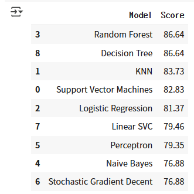

## train, test 함께 처리하는 방식
```py
train_df = pd.read_csv('train.csv')
test_df = pd.read_csv('test.csv')
combine = [train_df, test_df]
```

```py
for dataset in combine :
    dataset['Title'] = dataset.Name.str.extract('([A-Za-z]+)\.', expand=False)

pd.crosstab(train_df['Title'], train_df['Sex'])
```

- combine으로 묶은 후, train, test 데이터셋을 같은 방식으로 수정하고 싶을 때 for문을 사용해서 각각 같은 방식으로 바꾸기 (train 한번, test 한번 각각 바꿈)
<br/>
<br/>
<br/>


## Age 결측치 채우기
```py
for dataset in combine:
    for i in range(0, 2):
        for j in range(0, 3):
            guess_df = dataset[(dataset['Sex'] == i) & \
                                  (dataset['Pclass'] == j+1)]['Age'].dropna()

            # age_mean = guess_df.mean()
            # age_std = guess_df.std()
            # age_guess = rnd.uniform(age_mean - age_std, age_mean + age_std)

            age_guess = guess_df.median() # 중앙값 사용

            # Convert random age float to nearest .5 age
            guess_ages[i,j] = int( age_guess/0.5 + 0.5 ) * 0.5
                        
    for i in range(0, 2):
        for j in range(0, 3):
            dataset.loc[ (dataset.Age.isnull()) & (dataset.Sex == i) & (dataset.Pclass == j+1),\
                    'Age'] = guess_ages[i,j]

    dataset['Age'] = dataset['Age'].astype(int)

train_df.head()
```

- Age 결측치 채우기 위해 ```Sex```와 ```Pclass```를 기준으로 각 그룹의 Age의 중앙값을 계산하고, 이를 결측값에 대체!
- ```Sex```(남성, 여성)와 ```Pclass```(1,2,3)의 조합별로 중앙값을 구하고, 그 값을 ```Age``` 컬럼의 결측치에 할당해 데이터 채움
- EX. ```Sex```가 '남성', ```Pclass```가 '1'인 그룹의 ```Age``` 값이 결측치일 경우 그 그룹의 다른 '남성'이면서 '1'인 사람들의 ```Age``` 중앙값을 계산 
<br/>
<br/>
<br/>

## 두 가지 특성의 상호작용을 고려하기 위해 Age*Class라는 새로운 특성 만들기
- 같은 범주로 묶을 수 있는 Parch, SibSp을 더해서 FamilySize를 만드는 경우는 봤어도 아예 다른 특성을 곱하는건 또 처음 본다..! 왜 Age*Pclass를 만들까? 🤔
    - 이 데이터에서 Age와 Pclass는 모두 Survived에 영향을 주는 중요한 변수
        - Pclass : 1등급 객실 승객의 생존율이 가장 높고, 3등급 승객의 생존율이 가장 낮음
        - Age : 어린아이일수록 구조될 가능성이 높고, 나이가 많을수록 생존율이 낮을 가능성이 있음
    - 즉, Age와 Pclass를 따로 보는 것보다 **이 둘의 곱을 새로운 변수로 만들어서 생존율과의 관계를 더 잘 파악할 수 있음**!

<br/>
<br/>

- 나이가 많고(Age↑), 객실 등급이 낮으면(Pclass↑) → 위험한 상황<br/>
    ➡️ 3등급(Pclass=3) 객실을 이용하는 50세 승객(Age=50)은 Age*Class = 50 * 3 = 150이 됨.<br/>
    ➡️ 높은 값일수록 생존 가능성이 낮을 수도 있음

- 나이가 적고(Age↓), 객실 등급이 높으면(Pclass↓) → 유리한 상황<br/>
    ➡️ 1등급(Pclass=1) 객실을 이용하는 10세 승객(Age=10)은 Age*Class = 10 * 1 = 10이 됨.<br/>
    ➡️ 낮은 값일수록 생존 가능성이 높을 수도 있음
<br/>
<br/>


- 🚨 주의할 점
    1. Age*Class가 정말 유용한 특성인지 확인하려면, 상관관계 분석이나 특성 중요도(feature importance)를 살펴볼 필요가 있음

    2. 모델이 Age와 Pclass를 각각 따로 사용하는 것보다 Age*Class를 더 유용하게 활용하는지 확인하려면, 모델 성능을 비교하면서 검증해야 함

<br/>
<br/>
<br/>

## 훈련, 테스트 세트 나누기
```py
X_train = train_df.drop("Survived", axis=1)
Y_train = train_df["Survived"]
```
- Survived(타겟 변수, 레이블)는 Y_train으로 분리하고, 나머지 특징들은 모델의 입력값(독립 변수)로 사용하기 위해 X_train으로 분리
- 머신러닝 모델은 X_train을 보고 Y_train을 예측하는 법을 배우는 것

- shape 확인해서 올바르게 분리되었는지 확인하기!

```py
X_test = test_df.drop("PassengerId", axis=1).copy()
```
- 왜 테스트 데이터에서 PassengerId를 이 단계에서 제거할까? 앞에서 제거하면 안되나? 🤔
    - train에서는 PassengerId가 Survived과는 연관이 없다고 판단해 처음부터 제거해도 문제 없음
    - 캐글 같은 대회에서는 예측 결과를 제출할 때 각 승객의 ID와 예측 결과를 함께 제출해야 하므로, 예측 후에 제출할 때는 submission.csv 파일에 PassengerId를 포함해서 제출해야함
<br/>
<br/>
<br/>

## 모델 9개 


### Support Vector Machines (SVM)
- 분류와 회귀 문제를 해결하는 지도 학습 알고리즘
- ✳️ 특징: 작은 데이터셋에서도 뛰어난 성능, 복잡한 비선형 관계도 잘 분류
- ✳️ 목표: 두 개 이상의 클래스를 가장 잘 구분하는 **결정 경계**를 찾는 것
    - 결정 경계란?
        - 두 개의 클래스를 구분하는 선(2D), 평면(3D), 또는 초평면(n차원 공간에서의 결정 경계)
        <br/>

    - 마진이란?
        - 결정 경계와 가장 가까운 데이터 포인트 간의 거리 (데이터 포인트들이 결정 경계에서 멀리 떨어져 있을수록 좋음)
        - 마진이 클수록 일반화 성능이 좋음! 
        - SVM은 마진을 최대화하는 초평면을 찾음 = 즉 **가장 확실하게 구분하는 선**을 찾음
        <br/>

    - 서포트 벡터란?
        - 결정 경계를 정의하는 가장 중요한 데이터 포인트들 = 경계선 바로 근처에 있는 데이터
        - 서포트 벡터가 바뀌면 결정 경계도 바뀌므로 서포트 벡터는 SVM 핵심 요소

        <br/>

        - *선형 SVM* : 직선(2D), 평면(3D) 형태로 데이터 나눔
            - 데이터가 선형적으로 구분될 때, (차원이 많아도) 결정 경계가 직선 형태로 나오는 경우 사용 <br/>

            ```py
            from sklearn.svm import SVC
            model = SVC(kernel='linear')  # 선형 SVM
            model.fit(X_train, Y_train)
            ```
        <br/>

        - *비선형 SVM* : 곡선이나 복잡한 형태의 경계를 만듬
            - 데이터가 선형적으로 나뉘지 않을 때
            - 원래 공간에서는 곡선 형태로 나뉘어야 하는 데이터를 "고차원 공간"에서 직선으로 변환하여 분류 <br/>

            ```py
            model = SVC(kernel='rbf')  # 비선형 SVM (RBF 커널 사용)
            model.fit(X_train, Y_train)
            ```


### Linear SVC

### Perceptron

### Naive Bayes

